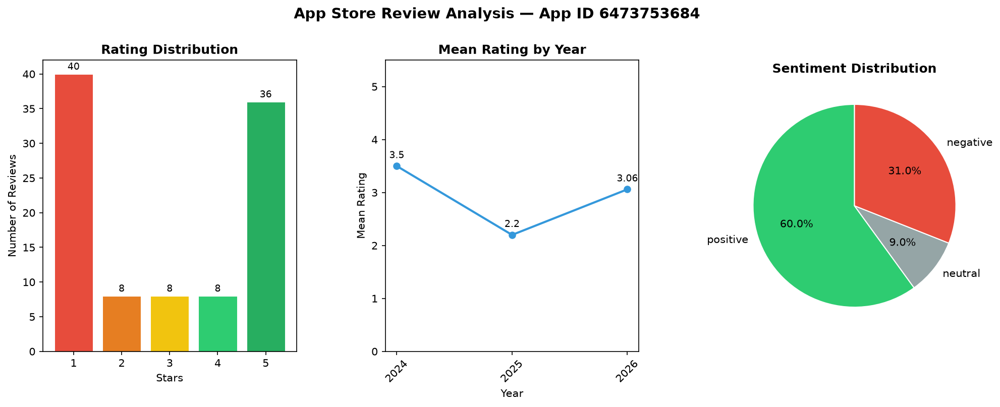

# App Store Review Analyzer

A REST API that collects user reviews from the Apple App Store, analyzes them using NLP techniques, and returns actionable insights for product teams.

---

## Running Locally

### Prerequisites

- Python 3.11+
- A supported LLM provider API key (Gemini, Anthropic, or OpenAI)

### Setup

```bash
git clone https://github.com/ooxyygeen/apple-store-review-analyzer.git
cd apple-store-review-analyzer

python -m venv .venv
.venv\Scripts\activate       # Windows
source .venv/bin/activate    # macOS/Linux

pip install -r requirements.txt
```

Copy `.env.example` to `.env` and fill in your API key:

```bash
cp .env.example .env
```

### Environment Variables

```dotenv
# Storage
DATA_DIR=.data/raw_reviews

# LLM provider — set the model and corresponding API key
# Gemini (default)
LLM_MODEL=gemini/gemini-2.5-flash-lite
GEMINI_API_KEY=

# Anthropic
# LLM_MODEL=anthropic/claude-haiku-4-5
# ANTHROPIC_API_KEY=

# OpenAI
# LLM_MODEL=openai/gpt-4o-mini
# OPENAI_API_KEY=
```

### Start the server

```bash
uvicorn app.main:app --reload
```

API docs available at `http://127.0.0.1:8000/docs`

---

## API Endpoints

| Method | Endpoint | Description |
|---|---|---|
| `POST` | `/reviews/collect?app_id=` | Collect 100 random reviews for the specified app |
| `GET` | `/reviews/insights?app_id=` | Return metrics and actionable insights |
| `GET` | `/reviews/download?app_id=` | Download raw reviews as JSON |
| `GET` | `/reviews/visualization?app_id=` | Return a PNG chart of key metrics |

The app ID is the numeric identifier found in the App Store URL:
`https://apps.apple.com/us/app/NAME/id1459969523` → `app_id=1459969523`

---

## Approach and Design Decisions

### 1. Data Collection

Apple does not provide an official public API for review scraping. After evaluating available options — including the `app-store-scraper` Python library (no longer maintained) and the iTunes RSS feed (returns empty results for many apps) — two working Apple endpoints were identified:

- **Metadata endpoint**: `itunes.apple.com/us/customer-reviews/id{app_id}` — returns total review count, average rating, and rating distribution
- **Reviews endpoint**: `itunes.apple.com/WebObjects/MZStore.woa/wa/userReviewsRow` — returns paginated reviews with full text, rating, author, and date

To collect **random** reviews, the system selects random offsets across the full review pool and fetch small batches at each offset, continuing until 100 unique reviews are collected. This avoids the bias of always fetching the most recent or most helpful reviews.

> **Limitation**: The implementation is hardcoded to the US App Store storefront (`X-Apple-Store-Front: 143441-1,32`). Supporting other regions would require mapping country codes to Apple storefront IDs and adapting the entire NLP pipeline for multilingual text (different stopword lists, language-specific lemmatizers, and a multilingual sentiment model such as `xlm-roberta-base-sentiment`).

> **Production note**: The collection endpoint is synchronous — the client waits ~30 seconds while reviews are fetched. In production this should be handled asynchronously using **Celery + RabbitMQ**, with the endpoint returning a job ID immediately and the client polling for completion.

### 2. Text Preprocessing

Two separate preprocessing pipelines are used depending on the downstream task:

- **For sentiment analysis** (`preprocess_for_sentiment`): preserves original casing and punctuation, only strips URLs and truncates to 500 words. VADER uses capitalization (`GREAT`, `AWFUL`) and punctuation (`!!!`) as sentiment signals, so aggressive cleaning would degrade accuracy.

- **For keyword extraction** (`preprocess_for_keywords`): lowercases, removes URLs and non-alphabetic characters, tokenizes, removes stopwords (nltk English stopwords + a custom app-review-specific list), and lemmatizes using **POS-aware lemmatization**. Standard `WordNetLemmatizer` defaults to treating every word as a noun, which causes verbs like "charged" and "charging" to not collapse to "charge". Passing the correct part-of-speech tag from `nltk.pos_tag` fixes this.

### 3. Sentiment Analysis

The app uses **VADER** (Valence Aware Dictionary and sEntiment Reasoner) from the `vaderSentiment` library. VADER is a rule-based model specifically designed for short social text — it handles informal language, capitalization, punctuation, and negations without any training or model download.

Reviews are classified as positive (`compound ≥ 0.05`), negative (`compound ≤ -0.05`), or neutral.

> **Limitation**: VADER struggles with implicit or context-dependent sentiment. A review saying "I lost my ex and this app gave me hope" may score negative due to the word "lost". Edge cases like sarcasm and non-English text are also misclassified.

> **Alternative**: A transformer-based model such as `cardiffnlp/twitter-roberta-base-sentiment-latest` (available via Hugging Face Inference API) would handle these cases significantly better. For production, a **fine-tuned DistilBERT** on a labeled app review dataset would offer the best balance of accuracy and inference speed.

### 4. Metrics Calculation

The following statistics are calculated from the 100 collected reviews:

- **Mean** — arithmetic average rating. Sensitive to outliers (many 1-star reviews drag it down even if most reviews are 5-star).
- **Median** — middle value when ratings are sorted. Resistant to outliers — useful when mean and median diverge significantly, which signals a polarized user base.
- **Mode** — most frequently given rating.
- **Standard deviation** — measures how spread out ratings are. A high std dev (e.g. 1.9 on a 1–5 scale) indicates a love-it-or-hate-it app with few moderate opinions.
- **Cumulative positive percentage** — percentage of reviews rated 3 stars or above.
- **Rating distribution** — count and percentage per star level.
- **Mean rating by year** — tracks whether sentiment is improving or degrading over time.

### 5. Keyword Extraction

Keywords are extracted only from **negative reviews** identified by sentiment analysis. We use frequency counting on lemmatized tokens after stopword removal.

**TF-IDF** with bigrams and trigrams (`sklearn.TfidfVectorizer`) was initially evaluated, which theoretically gives better results by downweighting generic terms. However, with only ~30 negative reviews in a sample of 100, TF-IDF does not have enough documents to meaningfully differentiate terms — scores become too similar to rank reliably. Frequency counting on a well-filtered token pool produces cleaner results at this scale.

### 6. Insights Generation

Rather than hardcoding a mapping of keywords to insights — which would be brittle and impossible to maintain across all possible apps and complaint themes — **an LLM is utilized to group keywords into topics and generate one actionable recommendation per topic**.

The LLM receives the top 10 keywords ordered by frequency and returns a JSON object where each key is a snake_case topic name and each value is a 1–2 sentence actionable insight for the development team.

**LiteLLM** serves as a provider-agnostic wrapper, meaning the implementation works with Gemini, Anthropic, or OpenAI by changing a single environment variable. This avoids vendor lock-in and lets the user run the project with whichever API key they have available.

### 7. API Design

The API separates **collection** and **analysis** into distinct endpoints intentionally:

- Collection is slow (~30s) and should only run when fresh data is needed
- Analysis is fast and can be re-run multiple times on the same collected data
- Raw data is preserved separately from derived metrics, so the download endpoint always serves the original unmodified reviews

All business logic lives in the `services/` layer, completely independent of FastAPI. Routes handle only HTTP concerns — request validation, error mapping, and response formatting. This makes services testable without spinning up the API.

---

## Known Limitations and Production Improvements

- **Region support**: Currently hardcoded to the US App Store. Supporting other regions requires a country-to-storefront-ID mapping and a multilingual NLP pipeline.
- **Async collection**: Replace synchronous collection with Celery + RabbitMQ. The `/collect` endpoint returns a job ID immediately; clients poll for completion.
- **Database storage**: Replace JSON file storage with PostgreSQL for concurrent access, querying, and historical tracking across multiple collection runs.
- **Response caching**: Cache the `/insights` response per app ID using Redis. Invalidate the cache when `/collect` is called for that app, avoiding redundant sentiment analysis and LLM calls.
- **Sentiment model**: Replace VADER with a fine-tuned DistilBERT or RoBERTa model trained on app review data for higher accuracy on implicit and context-dependent sentiment.

---

## Sample Report

### App: Claude by Anthropic (`app_id=6473753684`)

**Insights response:**

```json
{
  "app_id": 6473753684,
  "collected_at": "2026-06-15T13:28:08.456747+00:00",
  "total_reviews_in_store": 5348,
  "metrics": {
    "stats": {
      "count": 100,
      "mean": 2.92,
      "median": 3,
      "mode": 1,
      "std_dev": 1.8,
      "cumulative_positive_pct": 52
    },
    "distribution": {
      "1": {
        "count": 40,
        "percentage": 40
      },
      "2": {
        "count": 8,
        "percentage": 8
      },
      "3": {
        "count": 8,
        "percentage": 8
      },
      "4": {
        "count": 8,
        "percentage": 8
      },
      "5": {
        "count": 36,
        "percentage": 36
      }
    },
    "by_year": {
      "2024": {
        "count": 8,
        "mean_rating": 3.5
      },
      "2025": {
        "count": 20,
        "mean_rating": 2.2
      },
      "2026": {
        "count": 72,
        "mean_rating": 3.06
      }
    }
  },
  "actionable_insights": {
    "subscription_errors": "Users are encountering errors and limitations related to payments and subscriptions, preventing them from using the service. Investigate and resolve the payment processing and subscription limit errors.",
    "claude_functionality": "The core functionality associated with 'Claude' is not working as expected or is inaccessible. Address the bugs and issues preventing Claude from working correctly.",
    "usage_limits": "Users are hitting unspecified limits or encountering issues after a certain period, potentially monthly. Clarify and potentially adjust usage limits or subscription renewal terms.",
    "prompt_issues": "Users are experiencing problems with prompts, messages, or the inability to perform actions ('cant', 'doesnt work'). Improve prompt handling and error messaging for user input."
  }
}
```

**Metrics visualization:**


